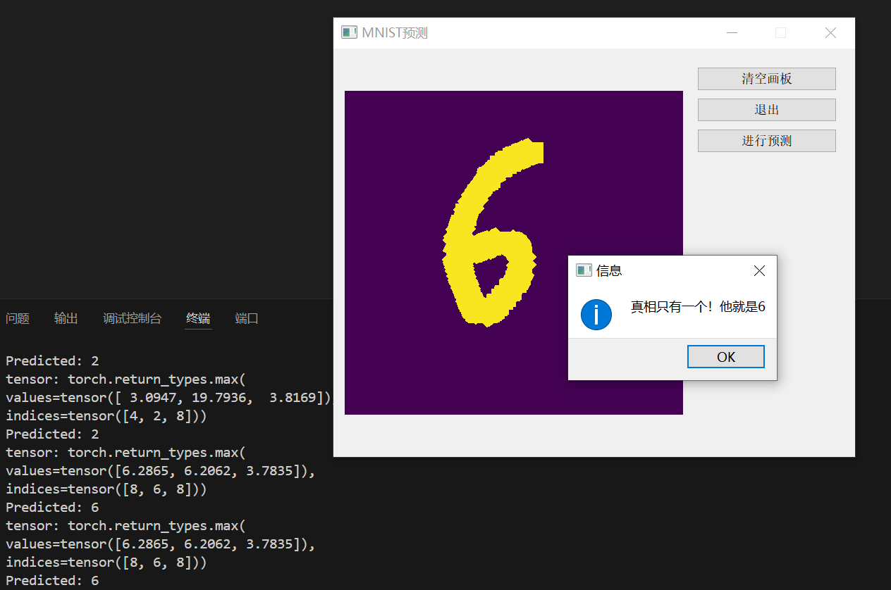
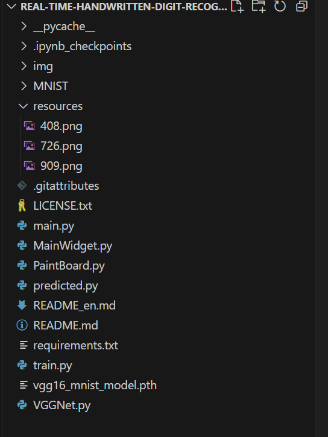

# Real-time handwritten digit recognition

*Read this in [中文](README.md).*
## introduce

Real-time handwritten digit recognition is a pyqt5 program made by using VGG16net training model file, which can recognize handwritten digits written by users on canvas in Real time, and display recognition results.

The program includes VGG16net training code, users can modify the training code to train their own model file, the predicted.py file loading model file path can be modified.

-----
## effect

-----

## Mode of use
### Environmental installation
Use pip to install dependencies: `pip install -r requirements.txt`

### operation
- 1. Run `python train.py` in the root directory of the project to train the model file by yourself
- 2. Run `python main.py` to run the program

### demo

-----

## Project structure

-----
## agreement
The code of this warehouse is open source according to [Apache-2.0](LICENSE).
